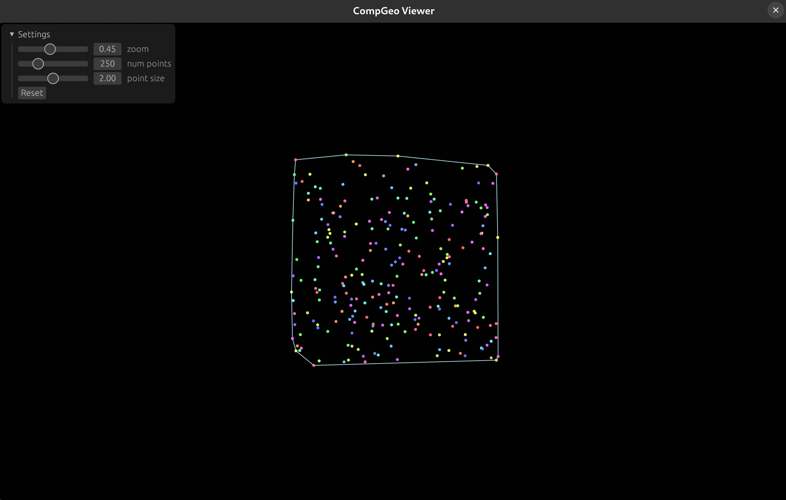

# Comp Geo Visualizer

App to visualize (and implementations of ) computational geometry algorithms.



```bash
cargo run --release
```

## TODO

- algo switcher
- mouse drawn points
- mouse deleted points
- different random point generation (square / circle)
- unnest app code
